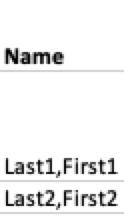
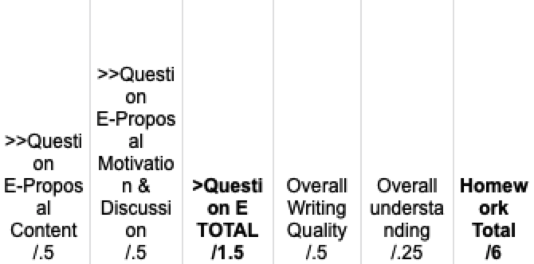
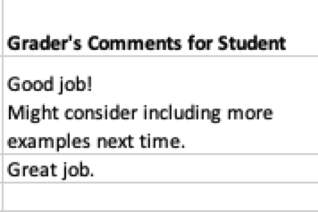

# Grades Out
This Python-based, commandline-enabled program functions as a utility tool that bridges online collaborative grading sheets and the feedback bulk-uploading functionality on LATTE (moodle-based learning management system at Brandeis).

This program processes an assignment grading sheet containing all students' grade details and distributes assignment grade breakdown & comments as a .txt to each student's folder (exported from LATTE).

# First-time users

Hello! 

Feel free to navigate the project by 
1. starting with looking at the [example grading sheet](example_gradesheet.csv) and [the example folder exported from LATTE](example_folders) (i.e. the two inputs you'll need to provide) and the example report outputs for [Jane Doe](example_folders/Jane%20Doe_2898000_assignsubmission_file_/Jane_Doe_ExampleAssignment_Grade_Feedback.txt), [John Smith](example_folders/John%20Smith_2898000_assignsubmission_file_/John_Smith_ExampleAssignment_Grade_Feedback.txt), and [Mary Lee](example_folders/Mary%20Lee_2898000_assignsubmission_file_/Mary_Lee_ExampleAssignment_Grade_Feedback.txt) (i.e. what outputs you can expect to get from running the program and where you can find them)
    - all example contents are made up and do not in any way refer to any real-world entities
2. following [the instructions](#set-up-and-usage) for set up and usage

# System Prerequisite
- Python 3.6.1 or above ([Anaconda recommended, choose your system on the left menu](https://docs.anaconda.com/anaconda/install/))
    - Mac Users: temporarily set the Anaconda Python as the default Python program in your system, [original post here](https://stackoverflow.com/questions/22773432/mac-using-default-python-despite-anaconda-install).
      ```
      $ export PATH="$HOME/anaconda3/bin:/usr/bin:/bin:/usr/sbin:/sbin:/usr/local/bin:$PATH"
      ```
      then type
      ```
      $ which python
      ```
      to see if the output directory now correctly ends with ```anaconda3/bin```.
      
        > If not, try changing ```anaconda3``` to ```anaconda``` and try again.
      
    - (Recommended) to permanently change the default Python, 
        1. figure out the working version export line from the above steps.
        2. Use command
            ```
            $ open ~/.bash_profile
            ```
            to open the file in the default text editor of your system
        3. Edit ```~/.bash_profile``` in your default editor by adding the ```export``` line at the beginning of the file and save it
        4. Now the change is made. Check it by restarting your command line emulator and type ```$ which python``` to see if the path is now set to the Python path you've just specified in ```~/.bash_profile```. 
        
- [pandas](https://pandas.pydata.org/pandas-docs/stable/getting_started/install.html)
    - After you have the correct default python program as shown above, Run the following command to install pandas
      ```
      $ python -m pip install --user pandas
      ```
      
- [Nameparser](https://pypi.org/project/nameparser/)
    - Similar to pandas, run the following
    ```
      $ python -m pip install --user nameparser
    ```

# Project Structure
This section walks you through the purpose of the main files in this project. Everyone using this program is advised to grasp the function of conv/latte_grading_conversion.csv, and the code scripts are only informational for programming purposes. 
## conv/latte_grading_conversion.csv
Sometimes referred to as "the conversion file" or "the name conversion file" in this walkthrough.

**Very Important**: if any name change is made on the grading sheet, make sure to update it under the "Name on Grading Sheet" column so that the name conversion code does not break due to no match found.

You must create this file before generating any reports. Follow the [set-up guide](#one-time-set-up-at-the-start-of-each-course) to generate it. 

## grades_out.py
Main program of this project. Learn how to collect input for it and use it [here](#distribute-reports-for-each-assignment).

## name_convert.py
Utility program for generating ```conv/latte_grading_conversion.csv```, which records the correspondence between LATTE folder names (e.g. "Mary Lee") and grading sheet names (e.g. "Lee,Mary"). 

Learn how to use it [here](#one-time-set-up-at-the-start-of-each-course).

## grading_item.py
Utility code for generating reports. You do not need to run this script through command line interface. 


...TBC
# Workflow from/to LATTE
## Downloading assignment folders

The following instructions will walk you through downloading submission folders from LATTE. 
1. On LATTE, click on the submission portal.
2. Click ```View all submissions``` under "Grading summary"
3. Right under the submission title, click on "Grading action" and then select ```Download all submissions``` in the drop down menu. A .zip file should then be automatically downloaded.
4. Decompress the .zip file , and now you will have all the submission folders for this assignment. Feel free to change the name of the decompressed folder to a shorter name for convenience in running scripts later (e.g. changing ```203LING-120B-1-Assignment 3, More on Constituency in NPs – due Thurs Sept 24-1245460``` to ```A3```).

    >Note: if a student has not handed in any submission by the time of the download, there will be no folder corresponding to that student in the downloaded .zip file.
5. Now resume to your previous instructions for either [one time set up](#one-time-set-up-at-the-start-of-each-course) or [grade distribution](#distribute-reports-for-each-assignment)

## Uploading folders populated with feedback file back to LATTE
There are two types of feedback files: 
- regular ones generated under corresponding folders
- stray ones generated under LATTE parent folder because a folder with corresponding name cannot be found.
### 1. Regular feedback files
1. Compress the immediate parent folder of the LATTE submission folders into a .zip file. Any name for the .zip file would be fine.
    > Note: you do not need to delete the stray files in this step. LATTE ignores them automatically.
1. On LATTE, click on the submission portal.
2. Click ```View all submissions``` under "Grading summary"
3. Right under the submission title, click on "Grading action" and then select ```Upload multiple feedback files in a zip``` in the drop down menu. 
4. Upload the file and click ```Import feedback file(s)```, then follow the prompt to finish uploading.

### 2. Stray feedback files
These files need to be uploaded to each student manually via LATTE.
1. On LATTE, click on the submission portal.
2. Click ```View all submissions``` under "Grading summary"
3. For each stray file: 
    - find the corresponding student's submission row, click on ```Grade``` button
    - once in grading view, on the review panel (the one with "Submission", "Grade", and "Feedback comments" etc.), locate "Feedback files"
    - upload the .txt report into "Feedback files"
    - Deselect "Notify students" if needed
    - Click ```Save changes```


# Set-up and Usage

Note that you can run all of the example commands in this section with the pre-packaged [example grading sheet](example_gradesheet.csv) and [example folders](example_folders). 
## One-time Set-up (at the start of each course)
Do the following for each class at the beginning of each semester. 
- Clone this repository (more detailed, visual instruction [here](https://blogs.sap.com/2019/07/12/how-to-clone-a-github-repository-to-local-mac-computer/)) to your computer by running the following two commands (e.g. on Terminal on macOS or Cygwin on Windows)

   ```
   $ cd /path/to/some/folder/
   $ git clone https://github.com/yonglin-wang/grades_out.git
   ```
   Now, you should be able to find the project at ```/path/to/some/folder/grades_out```
    > Note: Mac users can substitute opening Terminal and entering ```$ cd /path/to/some/folder/``` with right clicking on ```/path/to/some/folder/``` folder in Finder, and choose ```Services``` \> ```New Terminal at Folder```  in the pop-out menu
- Create name conversion .csv file by
   1. Assign work (e.g. introduction) to the students and wait for everyone to submit. Meanwhile, make sure your machine meets the [system prerequisites](#system-prerequisite). 
   2. [Download and decompress the .zip all students' LATTE folders](#workflow-fromto-latte) and put it under project root.
   3. Run name_convert.py, which generates the name display correspondence between LATTE folder names (e.g. "Mary Lee") and grading sheet names (e.g. "Lee,Mary"), by running
   
       ```
      $ cd <path to project>
      $ python name_convert.py <LATTE folder name> 
      ```
      For example, if the LATTE folders for each students are saved in ```/path/to/project/root/example_folders```, you can run ```name_convert.py``` by
       ```
      $ cd /path/to/project/root
      $ python name_convert.py example_folders
       ```
      Then, examine the prompt the make sure all folders are converted and open the conversion file, which by default is saved at ```conv/latte_grading_conversion.csv```.
   4. Check ```conv/latte_grading_conversion.csv``` for the correspondence between folder & grading sheet name display    
   5. Then, copy and paste the grading sheet name display to the grading sheet
        
     - If any changes are made to the names in the future, make sure to record it in ```conv/latte_grading_conversion.csv``` as well; otherwise, the code will break due to the lack of correspondence.
   
- It is recommended that **a copy of this project be created for each class** (e.g. one for Syntax II and one for Typology), because the file containing name display correspondence (i.e. latte_grading_conversion.csv) is specific for each class and the program currently does not support having multiples of such file.


- If any name changes needs to be made (e.g. modifying the names, adding/deleting name entries) on the grading sheet at any time, the recommended steps are: 
    1. change grading name in ```conv/latte_grading_conversion.csv```, and then 
    2. copy-paste the names under ```Name on Grading Sheet``` column from the .csv file on to the grading Google Sheets

## Distribute Reports (for each assignment)
Before we start this section, if you do not have a copy of the scripts on your computer already: copy a ready-to-use project from elsewhere, or [go through the one-time setup script](#one-time-set-up-at-the-start-of-each-course).

1. Starting from the Google Sheet in the browser, "prettify" it by doing the following:
    - clear out any #REF! errors on the sheet (just in case, but our program should be able to handle them)
    - configure the column names based on [grading item configuration guidelines](#grading-sheet-item-content-convention-dos-and-donts)
    - refer to [the grading sheet template file](template.csv) for a general sense of using formats and styles
2. Download the grading Google Sheet as either .csv (current sheet, UTF-8 encoding) or .xlsx and save it to project root.
    
    - In the latter case, take note of the sheet name. Note that, though both are supported, in general, **.csv format is encouraged** for faster processing.
3. Meanwhile, [download the submission folders as a .zip from LATTE](#workflow-fromto-latte) and decompress the .zip file into one (1) parent folder under project root. Then, this parent folder's immediate subdirectories should be each student's submission folder with a pattern of ```<student name>_<ID digits>_assignsubmission_file_```.
4. In Terminal on Mac (or any command line interface of your choice), do the following
   ```
   $ cd <project root path>
   $ python grades_out.py <LATTE parent folder> <grading sheet name> <assignment alias>
   ```
     > Note: again, Mac users can substitute opening Terminal and entering ```$ cd /path/to/some/folder/``` with right clicking on ```/path/to/some/folder/``` folder in Finder, and choose ```Services``` \> ```New Terminal at Folder``` in the pop-out menu
    
   For example, if all the LATTE folders are saved under ```/path/to/project/example_folders```, the grading sheet saved at the project root is ```/path/to/project/example_gradesheet.csv```, and you'd like the assignment to have an alias of ```ExampleAssignment```, run the following command:
   
   ```
   $ cd /path/to/project/
   $ python grades_out.py example_folders example_gradesheet.csv ExampleAssignment
   ```
   
   - Note: for the quickest way to fill in the project path after ```cd ``` in most terminal emulators, you can drag the project root folder from your file explorer and release it onto your commandline interface.
   - Note: if a comment cell is left blank, the report will by default include a ```(no comment entered)``` notice for that comment. 
   - Note: if a non-comment cell is left blank, the report will by default include a ```(no value entered)``` notice for that comment. 
   - If you want to overwrite existing feedback files, run the command with ```--allow_overwrite``` or ```-a```:
   
       ```
       $ python grades_out.py <LATTE parent folder> <grading sheet name> <assignment alias> -a
       ```
     
   - Currently, for students with available feedback but without a LATTE folder, the program will save their report immediately under the LATTE parent folder since they do not belong to any subdirectories. If you want the program to error out on such case instead, run the command with ```--disable_not_found```:
   
       ```
       $ python grades_out.py <LATTE parent folder> <grading sheet name> <assignment alias> --disable_not_found
       ```
   
5. Follow the program prompts to view a few sample reports and determine if you wish to continue with the current format.
  
   - In this step, check especially if the formatting of the file path, content of file path, formatting of the report, and content of the report are all correct and/or as desired.
   - For quality assurance, it is recommended to sample at least 10% of all reports.
6. After the program is done, the LATTE folders will be populated with feedback file, and the directory containing all the LATTE folders will be ready for [compression and bulk-upload back to LATTE](#uploading-folders-populated-with-feedback-file-back-to-latte)
    
# Grading Sheet Item Content Convention Do's and Don'ts
## Convention for all columns
Do:
- for any non-name column, you can add one or more indentation marks (```>```) to *the beginning* of an item (e.g. >Pt 1...); for each indentation mark, 4 spaces will be added before the item in the report. For non-comment columns with no indentation marks (usually "total" columns), an empty line will be appended for an effect of emphasis.
  
    e.g. if in the grading sheet, we have an item:
    
    ```
    >>Pt 1. Explanation, motivation, demonstration
    /.45
    ```
    for a student scoring .25, in the report we will have:
    ```
            Pt 1. Explanation, motivation, demonstration: .25/.45
    ```
    Notice each ```>``` indentation mark has been converted to 4 spaces.
    
    Alternatively, if we have do not have any indentation marks, a line break will be inserted at the beginning. For example, consider the following column name:
    
    ```
    Homework 1 TOTAL Grade
    ```
    For a student scoring A-, in the report we will have:
    ```
    
    Homework 1 TOTAL Grade: A-
    ```
    Notice an empty line has been inserted in the front.
    

Don't:
- Don't include colons at the end, as this will be handled by the script. For example, if you want to display ```Total: 6/6``` in the report, then the column name should be ```Total /6``` instead of ```Total: /6```.
- Don't name any non-name column as ```Name```

## The Name column
Example of a name column:



Do:
- Make sure the one and only column containing students' names is named exactly ```Name``` (Case must match)

Don't:
- Don't have any other non-name column named as ```Name```.

## Columns of score-containing sub-sections (e.g. Pt 1 (1-2) /.45, etc.)
Examples of score columns:



Do:
- Format the total score in Grade Sheet in one of the following ways:
    - number(s) both before and after the decimal point: ```Part 1. Total /d.(d+)```, e.g. ```Part 1. Total /1.25``` or ```Part 1. Total /0.7```
    - no number before decimal point: ```Part 1. Total /.(d+)```, e.g. ```Part 1. Total /.5```

- Have one or more whitespace character (e.g. regular spaces, tabs, alt+Enter line breaks in Excel) between the item description and the subsection total (e.g. /.45). E.g. an item title cell can look like:
    ```
    >Pt 1. Explanation, motivation, demonstration
    /.45
    ```
    Notice there's the required linebreak right before the subsection total /.45.
    
    If the grading sheet shows that a student scores .25 out of .45 in this subsection, their report will print:
    ```
        Pt 1. Explanation, motivation, demonstration: .25/.45
    ```
    Notice /.45 comes right after .25.
    
    However, if we have:
    ```
    >Pt 1. Explanation, motivation, demonstration/.45
    ```
    Notice there's no whitespace before the subsection total /.45.
    
    If the grading sheet shows that a student scores .25 out of .45 in this subsection, their report will print:
    ```
        Pt 1. Explanation, motivation, demonstration/.45: .25
    ```
    Notice our program no longer recognizes /.45. 
    

Don't:
- No need to make A#.print sheet columns "look nice" any more, i.e. no more dashes and/or abbreviations just to fit the item name in a narrow cell
- Don't include the word "comment" as part of the title, unless this column is intended for comments, or some 0 values under it may not be displayed properly.
## Comment columns
Example of a comment column:



Do:
- **Always include word "comment"** (case-insensitive) in the comment column(s) 
- Feel free to use line breaks (alt + enter in Google Sheets and Excel) in the comments, the format will be properly indented.

Don't:
- Don't include total score in comment columns. Comment display does NOT support section score display like its non-comment counterparts, e.g. if for any reason we have an item such as 
    ```
    Account comments 
    /.25
    ```
  it will not be treated as a subsection with scores and the output will be
  ```
  Account comments /.25: <some input from grading sheet>
  ```
# Known Issues and FAQ
## Displaying non-ascii names and Unicode errors
### Problem
If a non-ascii name is pasted and saved to ```conv/latte_grading_conversion.csv``` through a fancier word processor (such as Excel and Numbers), its encoding will confuse the program, causing either a program crash or the non-ascii character to be skipped.

Examples of such names include: é as in Mathéo, á as in János

Example of program error: 
```
UnicodeDecodeError: 'utf-8' codec can't decode byte 0x8e in position 9: invalid start byte
```

### Solution

Genereal rule of thumb for Unicode errors: *do NOT use Excel to open any .csv file created for this project* as it will tamper with the encoding. For example, it is OK to save a utf-8 encoded .csv file after the file is generated.

Instead of a fancy word processor, do the pasting and saving of the non-ascii character to ```conv/latte_grading_conversion.csv``` in a simpler program (e.g. TextEdit, Aquamacs, or vim if you may). Saving the .csv file there can allow the encoding to be recognizable by Python for most of the time. 

## Students with same LATTE name
Not yet tested. The solution largely depends on how LATTE handles it in the folder name. Currently, the program is designed to error out in this situation, before generating any reports in any student's folder. 

## Report file name already exists
To prevent undesirable overwriting, the program currently validates report saving paths before generating any reports. It errors out if a file with the same report name already exists under a student's folder.

However, in the case where we truly want to overwrite the files, for example, after making changes to grading columns after the reports have been generated, you can always trap the error by adding ```--allow_overwrite``` or simply ```-a```:
   ```
    $ python3 grades_out.py <LATTE parent folder> <grading sheet name> <assignment alias> -a
   ```

## Rounding Issues in .xlsx
### Problem
We might see the following output, especially when reading from an .xlsx spreadsheet:
```
Hwk 1 Total: 5.313000000000001/6
```
where as the grade is 5.313, without the trailing 0s and 1. 
This is possibly due to the float precision issue in ```pandas.DataFrame.read_excel()```.
### Solution
General piece of advice: use .csv for this project and avoid .xlsx, even though it is supported. 

If this happens, switch to exporting and using a .csv-format grading spreadsheet instead. We may be able to fix this in code in the future.

## What happens if student did not submit on LATTE but has score?
In this case, the report of that student will be generated immediately under the LATTE parent folder. For those reports, you will need to upload them to LATTE manually. 

Note that saving to parent directory could also happen when a student submits their work but drops the course after grading starts, which will cause LATTE to hide their submission folders. In this case, you do not need to upload the report or do anything with it.